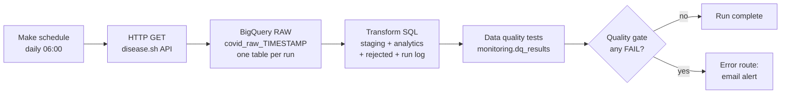

# eHealth COVID-19 Data Pipeline (No-Code ETL/ELT)

An automated data pipeline that extracts country-level COVID-19 statistics from a public API, loads them into Google BigQuery, transforms and validates them with SQL, tests data quality automatically after every run, and alerts by email when a test fails. A GPT-based data quality report is the final bonus step (in progress).

Built as an assessment for the **Data Engineer** role at eHealth4everyone.

> **Status:** work in progress. See the [Progress checklist](#progress-checklist).

---

## Objective

Design and implement an automated data pipeline using a no-code tool that:

1. Extracts data from a public API
2. Loads it into a data warehouse
3. Automates the ETL process
4. Includes automated testing for data accuracy and integrity
5. *(Bonus)* Uses GPT-4 to generate data quality reports or insights

## Tools and choices

| Component | Choice | Why |
|---|---|---|
| Orchestrator | **Make.com** (free plan) | Native HTTP, BigQuery and Gmail modules, visual workflow, error-handler routes, exportable blueprint |
| Warehouse | **Google BigQuery (sandbox)** | Free, no billing required, standard SQL |
| Data source | **disease.sh** `/v3/covid-19/countries` | Free, no API key, live, health-related |
| Transformation and tests | **SQL inside BigQuery** | Testable, versionable, and avoids Make's per-record operation costs |
| Alerting | **Gmail module on a Make error route** | Simple, visible, easy to demonstrate |
| Version control | **GitHub** | Deliverables, history and documentation |

## Architecture



### Layers

| Layer | Object | Purpose |
|---|---|---|
| `raw` | `covid_raw_<YYYYMMDD_HHMMSS>` | Untouched API records (one JSON string per country) plus ingestion time. Audit trail; can always be reprocessed. **One table per run.** |
| `staging` | `covid_countries_stg` | Flattened, typed, cleaned rows from all raw runs. Every row carries a `reject_reason` (NULL when valid). |
| `analytics` | `covid_country_daily` | Trusted final table: valid rows only, one row per country per day (latest record wins). Includes derived `case_fatality_pct`. |
| `monitoring` | `rejected_records` | Rows that failed a validation rule, with the reason. |
| `monitoring` | `pipeline_run_log` | One row per raw run: rows extracted, valid, rejected. |
| `monitoring` | `dq_results` | Results of the automated tests for the latest run. |

## Key design decisions

1. **ELT instead of row-by-row ETL.** Make bills per operation, and an iterator would run every module once per record (~230 times per run). Instead, Make fetches the whole response in one call and hands it to BigQuery in one query. Transformation and validation live in SQL, where they are easy to test.
2. **Raw layer stored as JSON strings.** If the API adds or renames fields, ingestion never breaks and the transformation can be fixed and re-run.
3. **Key = `country` + `snapshot_date`, not `iso3`.** Some entries in this API (for example cruise ships) have no ISO codes, so ISO codes are not reliable keys.
4. **Single source of truth for validation.** Rules live only in the staging query. `rejected_records` and `analytics` are both derived from `reject_reason`, so a rule change applies everywhere.
5. **Idempotency without `MERGE`.** Analytics keeps the latest record per country per day using `ROW_NUMBER()`, and every layer is rebuilt with `CREATE OR REPLACE`. Running the pipeline any number of times in a day produces one row per country.
6. **Bad data never crashes a run.** `SAFE_CAST` returns NULL for values that cannot be converted; validation rules then route those rows to `rejected_records`.
7. **Tests are one SQL statement.** All metrics are computed once and turned into test rows, so the whole suite is cheap and readable. Each test has a severity: `ERROR` tests can produce a `FAIL`; `WARN` tests flag issues for review without stopping the pipeline.
8. **Quality gate via `ERROR()`.** Make cannot easily branch on query results, so a final query calls BigQuery's `ERROR()` function when any test has failed. Make sees a failed module and runs the error route, which sends the alert. The decision logic stays in SQL.

## Validation rules (staging)

A row is rejected, with the stated reason, if:

| Reason | Condition |
|---|---|
| `missing_country` | country is NULL or blank |
| `missing_or_invalid_updated` | source timestamp cannot be parsed |
| `future_date` | snapshot date is after today |
| `missing_cases` | cases is NULL |
| `negative_count` | cases or deaths below 0 |
| `deaths_exceed_cases` | deaths greater than cases |

## Automated data quality tests

Run after every load by `sql/04_dq_tests.sql`. Results are written to `monitoring.dq_results` (13 tests).

| Category | Test | Severity |
|---|---|---|
| Reconciliation | raw rows = staging rows | FAIL |
| Reconciliation | analytics rows from this run = valid staging rows | FAIL |
| Uniqueness | no duplicate country + date in analytics | FAIL |
| Completeness | no NULLs in country, date, cases | FAIL |
| Validity | no negative counts | FAIL |
| Validity | deaths not greater than cases | FAIL |
| Validity | no future dates | FAIL |
| Validity | fatality % between 0 and 100 | FAIL |
| Freshness | ingested within 26 hours | FAIL |
| Freshness | source data updated within 48 hours | FAIL |
| Schema | all expected columns present in analytics | FAIL |
| Quality | rejection rate at most 5% | WARN |
| Quality | missing population at most 5% of rows | WARN |

## Automation and alerting

The Make scenario `covid_pipeline_main` runs **daily at 06:00** and contains:

1. **HTTP** `GET /v3/covid-19/countries` (Parse response = No)
2. **BigQuery Run a Query**: raw load (`sql/01_make_raw_load.sql`)
3. **BigQuery Run a Query**: transformation (`sql/02_transform.sql`)
4. **BigQuery Run a Query**: data quality tests (`sql/04_dq_tests.sql`)
5. **BigQuery Run a Query**: quality gate (`sql/06_dq_gate.sql`)
6. **Gmail Send an email** on the gate module's **error route**, containing the failing test names and values

A full run is about 5 operations, so a daily schedule fits comfortably within the free plan (check current plan limits).

## Demonstrated failure and alert

`sql/05_inject_bad_data.sql` creates a deliberately bad raw run with a duplicate record, a negative case count, deaths above cases, a missing country and a future date. Observed results:

| Check | Result |
|---|---|
| Rejected records | bad rows captured with reasons |
| `raw_rows_equal_staging_rows` | PASS (raw=6, staging=6) |
| `analytics_rows_equal_valid_staging_rows` | **FAIL** (analytics=1, valid=2, the duplicate collapsed) |
| `rejection_rate_at_most_5_pct` | **WARN** (66.67%) |
| Alert | email received: *DATA QUALITY FAILED ... analytics_rows_equal_valid_staging_rows (analytics=1, valid=2)* |

The bad table was then dropped and the pipeline returned to all tests passing.

## Verified results (clean run, 2026-09-29)

| Check | Result |
|---|---|
| Rows in raw run | 231 |
| Rows in staging | 231 |
| Rows rejected | 0 |
| Rows in analytics | 231 |
| Reconciliation | staging = analytics + rejected |

Top countries by cases: USA (about 111.8M), India (about 45.0M), France (about 40.1M), Germany (about 38.8M).

## Known limitations (sandbox)

The BigQuery **sandbox blocks DML** (`INSERT`, `UPDATE`, `DELETE`, `MERGE`) unless billing is enabled, and billing was not available. The design was adapted:

- Raw data is written as **one new table per run** (`CREATE TABLE ... AS SELECT`) and queried with a wildcard (`covid_raw_*`) instead of appending to one table.
- Analytics is **rebuilt from raw history** with `CREATE OR REPLACE TABLE` instead of an incremental `MERGE`.
- `dq_results` and `pipeline_run_log` hold the **latest run only**, not a history, because rows cannot be appended.
- The alert covers `FAIL` results only; `WARN` results are recorded but do not email.
- Sandbox tables expire after 60 days by default.
- The error route uses the Ignore directive, so a failed gate is signalled by email rather than by marking the scenario as failed.

**At production scale** I would enable billing, append to a single partitioned raw table, use `MERGE` for incremental loads, keep a history of test results, and move transformations to dbt or Dataform with orchestration in Airflow or Cloud Composer.

## Progress checklist

- [x] **Phase 1** Accounts, API check, four BigQuery datasets (`raw`, `staging`, `analytics`, `monitoring`), all in `US`
- [x] **Phase 2** Table design
- [x] **Phase 3** Make scenario: HTTP call and BigQuery raw load
- [x] **Phase 4** Transformation SQL: staging, rejected records, analytics, run log
- [x] **Phase 5** Automated data quality tests and `dq_results`
- [x] **Phase 6** Full scenario in Make, quality gate, email alert, daily 06:00 schedule
- [ ] **Phase 7** GPT data quality report (bonus)
- [ ] **Phase 8** Architecture diagram export, Make blueprint export, design document
- [ ] **Phase 9** Demo video

## Challenges and how they were solved

| Problem | Cause | Fix |
|---|---|---|
| `[403] DML queries are not allowed in the free tier` | Sandbox blocks `INSERT`/`MERGE` | Redesigned around DDL: one raw table per run, `CREATE OR REPLACE` for downstream layers |
| `[409] Already Exists: ... covid_raw_` | Table name built from a Make variable resolved to empty, so every run tried to create the same name | Build the table name inside SQL with `FORMAT_TIMESTAMP` and `EXECUTE IMMEDIATE` |
| Tables created but empty (0 rows) | API `Data` value was not mapped into the BigQuery query, so `UNNEST` of an empty string returned nothing and BigQuery still reported success | Re-mapped the HTTP `Data` field; verified by inspecting the module's Input; confirmed with row counts |
| Need to alert on test failures without branching on query output | Make cannot easily read BigQuery result rows into a decision | Quality gate query raises `ERROR()` on failure; Make's error route sends the email |
| Bad test data hidden by a newer good run | "Latest run" is chosen by table-name suffix | Demo table is named with a timestamp later than the run being triggered |

**Lesson:** a successful job status does not prove data landed. The row-count reconciliation tests exist for exactly this reason.

## Repository structure

```
ehealth-data-pipeline/
├── README.md
├── sql/
│   ├── 01_make_raw_load.sql      # Make module: raw load (template with mapping pill)
│   ├── 02_transform.sql          # staging, rejected records, analytics, run log
│   ├── 03_verification.sql       # manual verification queries
│   ├── 04_dq_tests.sql           # automated data quality tests -> dq_results
│   ├── 05_inject_bad_data.sql    # demo: deliberately bad run
│   ├── 06_dq_gate.sql            # quality gate that triggers the alert
│   └── 07_report_input.sql       # summary JSON for the GPT report (Phase 7)
├── workflow/                     # Make blueprint JSON (Phase 8)
├── docs/                         # design document (Phase 8)
└── screenshots/                  # evidence for the demo and README
```

## How to reproduce

1. Create a Google Cloud project with BigQuery sandbox. Create datasets `raw`, `staging`, `analytics`, `monitoring` in location `US`.
2. In Make.com create a scenario: **HTTP > Make a request** (GET `https://disease.sh/v3/covid-19/countries`, Parse response = **No**), followed by four **BigQuery > Run a Query** modules using `sql/01`, `02`, `04` and `06`. In module 1, map the HTTP `Data` field into the `r'''...'''` string.
3. Add a **Gmail > Send an email** module on the error route of the last BigQuery module.
4. Run the scenario once and confirm a `covid_raw_<timestamp>` table, populated staging and analytics tables, and 13 passing tests.
5. Schedule the scenario daily.
6. To test the alert, run `sql/05_inject_bad_data.sql`, then run the scenario again.

## Security

No API keys, OAuth tokens or account emails are committed. The disease.sh API requires no key. Make, Google and Gmail connections are stored in Make and are not part of any exported blueprint. Screenshots are cropped to hide account email addresses.
