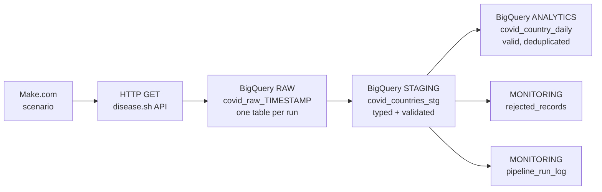

# eHealth COVID-19 Data Pipeline (No-Code ETL/ELT)

An automated data pipeline that extracts country-level COVID-19 statistics from a public API, loads them into Google BigQuery, transforms and validates them with SQL, and (in progress) tests data quality automatically and generates a GPT-based quality report.

Built as an assessment for the **Data Engineer** role at eHealth4everyone.

> **Status:** work in progress. See the [Progress checklist](#progress-checklist) for what is done and what is next.

---

## Objective

Design and implement an automated data pipeline using a no-code tool that:

1. Extracts data from a public API
2. Loads it into a data warehouse
3. Automates the ETL process
4. Includes automated testing for data accuracy and integrity
5. *(Bonus)* Uses GPT-4 to generate data quality reports or insights

## Tools and choices

| Component | Choice | Why |
|---|---|---|
| Orchestrator | **Make.com** (free plan) | Native HTTP and BigQuery modules, visual workflow, exportable blueprint |
| Warehouse | **Google BigQuery (sandbox)** | Free, no billing required, standard SQL |
| Data source | **disease.sh** `/v3/covid-19/countries` | Free, no API key, live (updates every run), health-related |
| Transformation | **SQL inside BigQuery** | Testable, versionable, and avoids Make's per-record operation costs |
| Version control | **GitHub** | Deliverables, history and documentation |

## Architecture



### Layers

| Layer | Object | Purpose |
|---|---|---|
| `raw` | `covid_raw_<YYYYMMDD_HHMMSS>` | Untouched API records (one JSON string per country) plus ingestion time. Audit trail; can always be reprocessed. **One table per run.** |
| `staging` | `covid_countries_stg` | Flattened, typed, cleaned rows from all raw runs. Every row carries a `reject_reason` (NULL when valid). |
| `analytics` | `covid_country_daily` | Trusted final table: valid rows only, one row per country per day (latest record wins). Includes derived `case_fatality_pct`. |
| `monitoring` | `rejected_records` | Rows that failed a validation rule, with the reason. |
| `monitoring` | `pipeline_run_log` | One row per raw run: rows extracted, valid, rejected. |
| `monitoring` | `dq_results` | Automated test results *(Phase 5)* |

## Key design decisions

1. **ELT instead of row-by-row ETL.** Make bills per operation, and an iterator would run every module once per record (~230 times per run). Instead, Make fetches the whole response in one call and hands it to BigQuery in one query. A full run costs about 3 operations. Transformation and validation live in SQL, where they are easy to test.
2. **Raw layer stored as JSON strings.** If the API adds or renames fields, ingestion never breaks and the transformation can be fixed and re-run.
3. **Key = `country` + `snapshot_date`, not `iso3`.** Some entries in this API (for example cruise ships) have no ISO codes, so ISO codes are not reliable keys.
4. **Single source of truth for validation.** Rules live only in the staging query. `rejected_records` and `analytics` are both derived from `reject_reason`, so a rule change applies everywhere.
5. **Idempotency without `MERGE`.** Analytics keeps the latest record per country per day using `ROW_NUMBER()`, and every layer is rebuilt with `CREATE OR REPLACE`. Running the pipeline any number of times in a day produces one row per country.
6. **Bad data never crashes a run.** `SAFE_CAST` returns NULL for values that cannot be converted; validation rules then route those rows to `rejected_records`.

## Validation rules (staging)

A row is rejected, with the stated reason, if:

| Reason | Condition |
|---|---|
| `missing_country` | country is NULL or blank |
| `missing_or_invalid_updated` | source timestamp cannot be parsed |
| `future_date` | snapshot date is after today |
| `missing_cases` | cases is NULL |
| `negative_count` | cases or deaths below 0 |
| `deaths_exceed_cases` | deaths greater than cases |

## Known limitations (sandbox)

The BigQuery **sandbox blocks DML** (`INSERT`, `UPDATE`, `DELETE`, `MERGE`) unless billing is enabled, and billing was not available. The design was adapted:

- Raw data is written as **one new table per run** (`CREATE TABLE ... AS SELECT`) and queried together with a wildcard (`covid_raw_*`) instead of appending to one table.
- Analytics is **rebuilt from raw history** with `CREATE OR REPLACE TABLE` instead of an incremental `MERGE`.
- Sandbox tables expire after 60 days by default.
- Streaming inserts are unavailable, so the Make "insert row" module is not used.

**At production scale** I would enable billing, append to a single partitioned raw table, use `MERGE` for incremental loads, and move transformations to dbt or Dataform with orchestration in Airflow or Cloud Composer.

## Progress checklist

- [x] **Phase 1** Accounts, API check, four BigQuery datasets (`raw`, `staging`, `analytics`, `monitoring`), all in `US`
- [x] **Phase 2** Table design and DDL
- [x] **Phase 3** Make scenario: variable, HTTP call, BigQuery raw load (231 rows verified)
- [x] **Phase 4** Transformation SQL: staging, rejected records, analytics, run log
- [ ] **Phase 5** Automated data quality tests, `dq_results`, failure alert
- [ ] **Phase 6** Add transformation and tests to the Make scenario, schedule daily runs
- [ ] **Phase 7** GPT-4 data quality report (bonus)
- [ ] **Phase 8** Architecture diagram export, Make blueprint export, final docs
- [ ] **Phase 9** Demo video

## Verified results (run of 2026-09-29)

| Check | Result |
|---|---|
| Rows in raw run | 231 |
| Rows in staging | 231 |
| Rows rejected | 0 |
| Rows in analytics | 231 |
| Reconciliation | staging = analytics + rejected |

Top countries by cases in analytics: USA (about 111.8M), India (about 45.0M), France (about 40.1M), Germany (about 38.8M).

## Challenges and how they were solved

| Problem | Cause | Fix |
|---|---|---|
| `[403] DML queries are not allowed in the free tier` | Sandbox blocks `INSERT`/`MERGE` | Redesigned around DDL: one raw table per run, `CREATE OR REPLACE` for downstream layers |
| `[409] Already Exists: ... covid_raw_` | Table name built from a Make variable resolved to empty, so every run tried to create the same name | Build the table name inside SQL with `FORMAT_TIMESTAMP` and `EXECUTE IMMEDIATE` |
| Tables created but empty (0 rows) | API `Data` value was not mapped into the BigQuery query, so `UNNEST` of an empty string returned nothing and BigQuery still reported success | Re-mapped the HTTP `Data` field; verified by inspecting the module's Input; confirmed with row counts |
| Search for the BigQuery module returned other Google apps | Make search matches on the app name | Searched `BigQuery` as one word; module is named **Run a Query** |

**Lesson:** a successful job status does not prove data landed. Row-count reconciliation tests (Phase 5) exist for exactly this reason.

## Repository structure

```
ehealth-data-pipeline/
├── README.md
├── sql/
│   ├── 01_make_raw_load.sql      # query used in the Make BigQuery module
│   ├── 02_transform.sql          # staging, rejected records, analytics, run log
│   └── 03_verification.sql       # manual verification queries
├── workflow/                     # Make blueprint JSON (Phase 8)
├── docs/                         # design document (Phase 8)
└── screenshots/                  # evidence for the demo and README
```

## How to reproduce

1. Create a Google Cloud project with BigQuery sandbox. Create datasets `raw`, `staging`, `analytics`, `monitoring` in location `US`.
2. In Make.com create a scenario: **Tools > Set variable** (optional), **HTTP > Make a request** (GET `https://disease.sh/v3/covid-19/countries`, Parse response = **No**), **BigQuery > Run a Query** using `sql/01_make_raw_load.sql`. Map the HTTP `Data` field into the `r'''...'''` string.
3. Run the scenario once. Confirm a `covid_raw_<timestamp>` table appears in `raw`.
4. Run `sql/02_transform.sql` in BigQuery.
5. Check the results with `sql/03_verification.sql`.

## Security

No API keys, OAuth tokens or account emails are committed. The disease.sh API requires no key. Make and Google connections are stored in Make and are not part of any exported blueprint.
